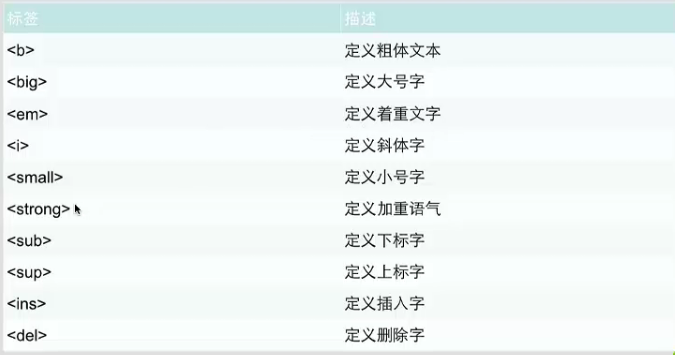
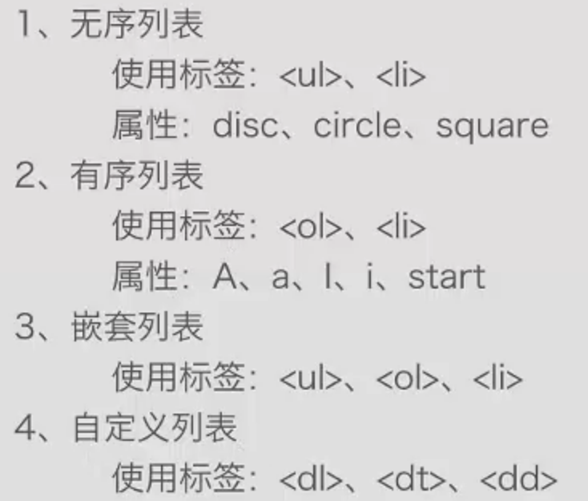
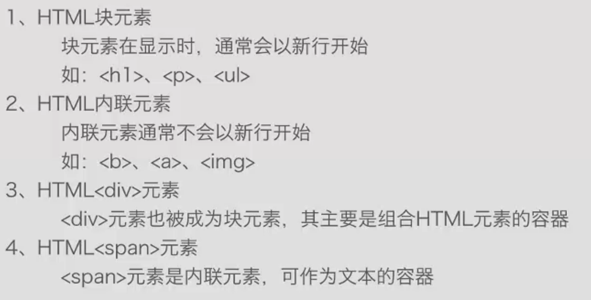

## HTML5基础

### HTML格式与部分元素
  ```html
  <!-- 文档类型说明 -->
  <!Doctype html>
  <!--根节点-->
  <html>
    <!--头部信息-->
    <head>
      <!--元信息-->
      <meta charset="utf-8" />
      <!--标题-->
      <title>HTML基础</title>
    </head>
    <!--包含页面内的所有主体内容-->
    <body>
      <!--直接显示文本-->
      Hello Html5!
      <!-- class:给元素添加一个或多个样式表类名 -->
      <p class="header">here is title!</p>
      <!-- contenteditable:表示文件是否可编辑 -->
      <p contenteditable="true">可编辑</p>
      <!-- 显示内容的开始位置 -->
      <p dir="rtl">在右边哟,不是在左边</p>
      <!-- id：元素的唯一标识 -->
      <h1 id="myheader">这是显示id的作用!</h1>
      <!-- style：行内元素的样式 -->
      <p style="color: blue;text-align: center">这是标题</p>
      <p style="color:red">这也是标题</p>
      <p style="color: yellow;text-align: center;">标题</p>
      <!-- tabindex：tab键的选取顺序 -->
      <a href="http://www.baidu.com/" tabindex="1">Baidu</a>
      <a href="http://www.aliyun.com/" tabindex="3">Aliyun</a>
      <a href="http://www.tencent.com/" tabindex="2">Tencent</a>
      <!-- title：鼠标悬停时显示的信息 -->
      <span title="http://www.jd.com/">JD</span>
    </body>
  </html>
  ```

1. HTML基础标签
  - head、body
  ```html
  <!DOCTYPE html>
  <html lang="en">
  <head>
      <meta charset="UTF-8">
      <title>JeffQi</title>
  </head>
  <body>
  </body>
  </html>
 ```

2. HTML标题
  - \<h1\>到\<h6\>缩进标签
  ```html
  <h1>标题1</h1>
  ```

3. HTML段落
 - \<p\>标识段落
 ```html
 <p>message</p>
 ```

4. HTML超链接
  - \<a\>标识超链接
  ```html
  <a href="http://www.baidu.com/">Baidu</a>
  ```

5. HTML图像
  - 标签为图片
  ```html
  
  ```

### HTML元素
1. 元素
  - 元素是指开始标签从开始到结束标签的所有代码
  ```html
  <p>元素</p>
  <br/>：换行标签（空元素标签）
  ```

2. 语法
  1. 空元素在开始标签中结束关闭
  2. 大多数HTML元素可以嵌套

### HTML属性
1. 标签可以拥有属性为元素提供更多信息
2. 属性以键值对形式出现
3. 常用标签
  1. \<h1>:align对其方式
    ```html
    <h1 align="right">title 1</h1>
    ```

  2. \<body>：bgcolor背景颜色
    ```html
    <body bgcolor="#82cf05">
    ```

  3. \<a>:target规定在何处打开

    ```html
    <a href="localhost.html" target="_self">localhost</a>
    1. _self：当前页面打开
    2. _blank：新页面打开
    ```
4. 通用属性：
  1. class：规定元素的类名
  2. id：标记元素的唯一ID
  3. style：规定元素的样式
  4. title：元素额外信息

### HTML格式化


### HTML列表


#### HTML块


### HTML样式
1. 标签
  - \<style>：样式定义
  - \<link>：资源引用

2. 属性
  1. rel="syslesheet"：外部样式表
  2. type="text/css"：引入文档的类型
  3. margin-left：边距

3. 插入方法
  1. 外部样式表
  ```html
  <link rel='stylesheet' type="text/css" href="mystyle.css">
  ```

  2. 内部样式表
  ```html
  <style type="text/css">
  body {background-color: gred}
  </style>
  ```

  3. 内联样式表
  ```html
  <p style="color:red">
  ```

### HTML布局
- div布局
- table布局

### HTML链接属性
1. 链接数据：
  - 文本链接
  - 图片链接

2. 属性
  - href：指向另一个文档的链接
  - name：创建文档内的链接（同一页面内的内容跳转）

3. img标签属性
 - alt：替换文本属性
 - width：宽
 - height：高

```html
<!DOCTYPE html>
<html lang="en">
<head>
    <meta charset="UTF-8">
    <title>JeffQi</title>
</head>
<body>
    <a href="http://www.baidu.com">baidu</a>
    <br/><br/>
    <a href="http://www.baidu.com">
        
    </a>
</body>
</html>
```

### HTML表单
```html
<!DOCTYPE html>
<html lang="en">
<head>
    <meta charset="UTF-8">
    <title>JeffQi</title>
</head>
<body>
    <form >
        用户：
        <input type="text">
        <br/>
        密码：
        <input type="password">
        <br/>
        <input type="submit" value="sign in">
        <br/>
        多选:
        <br/>
        苹果：<input type="checkbox">
        西红柿：<input type="checkbox">
        <br/>
        性别：
        <br/>
        男：<input type="radio" name="sex">
        女：<input type="radio" name="sex">
        <br/>
        选项网址：
        <br/>
        <select>
            <option>www.baidu.com</option>
            <option>www.google.com</option>
            <option>www.jeffqi.com</option>
        </select>
        <input type="button" value="button">
    </form>
    <textarea cols="30" row="30">填写个人信息</textarea>
</body>
</html>
```
