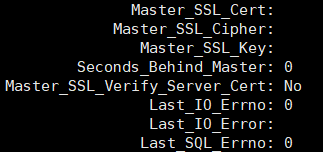
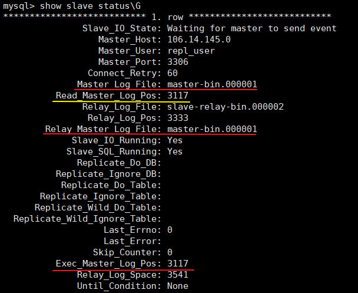

## MySQL主从复制同步检查
### 关于 seconds_behind_master 参数

- sbm参数事从服务器落后与主服务器的时间
- 由于主服务器性能或者网络等问题，可能导致，主服务器的日志到达从服务器的时候就已经很慢，不能通过这个时间直接判断
  1. sbm出现NULL值：
    - 出现空值时主从复制就断了或者停止工作
  2. sbm值大于等于0：
    - 大于0时，则主从服务器已经数据不一致，有滞后现象
    - 等于0时，只能说明SQL解析线程relay_log到目前为止没有延迟

### 稍微准确的方法

1. 首先查看master_log_file参数，同relay_master_log_file参数的差异，比较日志的同步情况
2. 其次查看read_master_log_pos和exec_master_log_pos参数的差异，比较日志的读取和执行差异
3. 最后查看seconds_behind_master参数

### 较新的GTID和pt工具
1. 较新的GIID的复制方式有更好的方式来判断时间点主从复制的差异
2. pt工具中的beatheart判断
  - pt工具：在主服务器上有一个库表，定时写入数据，从服务器读取来分析差异
