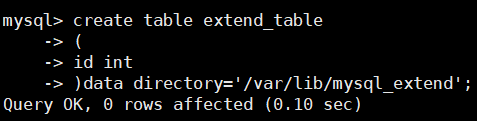
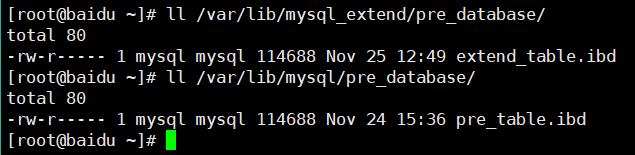
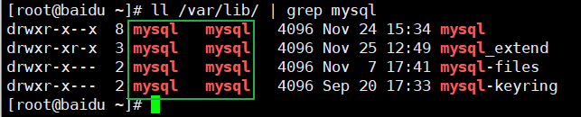
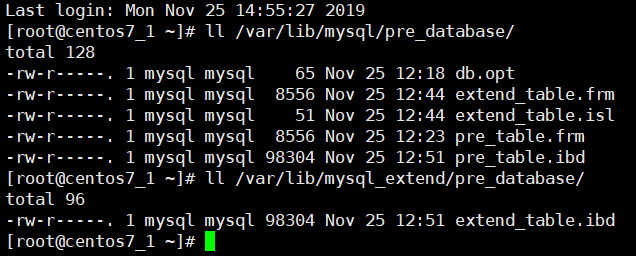
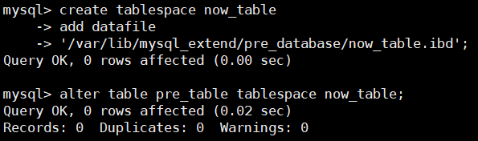
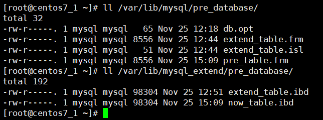
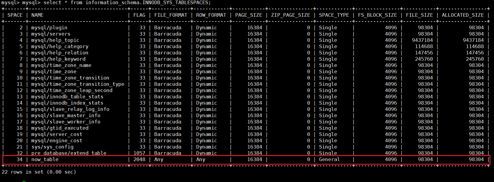

<!-- TOC START min:1 max:3 link:true asterisk:false update:true -->
- [MySQL外部表（MySQL8.0）](#mysql外部表mysql80)
  - [使用原因](#使用原因)
- [实验实例](#实验实例)
  - [实验迁移（MySQL5.7）](#实验迁移mysql57)
- [问题](#问题)
<!-- TOC END -->
<!--more-->

# MySQL外部表（MySQL8.0）
- 使用MySQL的外部表进行数据的迁移可扩展

## 使用原因
- 存储空间不够，一些大表需要更大的存储空间
- 存储介质更新，需要迁移到更块的介质中

# 实验实例
- 源数据库位于 /var/lib/mysql/pre_database
- 外部表库位于 /var/lib/mysql_extend/pre_database
1. 新建的表，位于新的存储位置
  ```sql
  CREATE TABLE `mysql_extend_table`
  (
  id INT NOT NULL PRIMARY KEY,
  name VARCHAR(10),
  age INT(3) NOT NULL DEFAULT 21
  )DATA DIRECTORY = '/var/lib/mysql_extend';
  ```

  

2. 可以看见，新建的表已经在指定的存储位置

  

3. **注意相应文件夹权限要够**
  

## 实验迁移（MySQL5.7）

1. 转移前
  

1. 创建表空间
  ```sql
  CREATE tablespace mysql_pre_table
  ADD datafile '/var/lib/mysql_extend/pre_database/tra_table.ibd';
  ```
  

2. 迁移表
  ```sql
  ALTER TABLE mysql_pre_table tablespace mysql_pre_table;
  ```

3. 结果:原pre_table转移为现在的now_table
  

4. 查看表空间
  ```sql
  SELECT * FROM information_schema.INNODB_SYS_TABLESPACES;
  ```
  
  1. FILE_FORMAT:ANY ROW_FORMAT:ANY SPACE_TYPE:General 表明：
    1. 这个表空间并不是 per_table 的，是可以多个表公用的存储空间

# 问题
1. 在MySQL8.0中无法在其他数据目录下创建tablespace
  - 需要配置 innodb_directories 参数：官方文档链接(https://dev.mysql.com/doc/refman/8.0/en/innodb-parameters.html#sysvar_innodb_directories)
  - 定义要在启动时扫描的表空间文件的目录。当服务器脱机时将表空间文件移动或还原到新位置时，将使用此选项。它还用于指定使用绝对路径创建或位于数据目录外部的表空间文件的目录

2. 在MySQL8.0中，将表创建在其他地方，不会在当前数据目录下创建任何东西，无 .isl 文件
