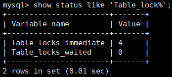
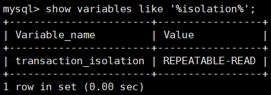

## MySQL锁机制
### 锁
- 计算机协调多个进程或线程并发访问同一资源的机制
- 锁分类
  1. 表锁：开销小，性能差
  2. 页锁：介于行锁与表锁之间
  3. 行锁：开销大，性能好，适于高并发
- 读锁：阻塞写不阻塞读，只能操作自己上锁表和数据
- 写锁：同时阻塞读写，其他会话的写操作会阻塞

### 表锁
1. 查看加锁表
  ```
  show open tables;
  ```
2. 查看分析表锁
  ```
  show status like 'Table_lock%';
  table_lock_immediate  #累计加锁次数
  table_lock_waited #正在等待的加索的进程
  ```
  

### 行锁
1. 事务的ACID特性（原子性，一致性，隔离性，持久性）
2. 事务隔离级别（read uncommited,read commited,repeatable read,lock read）
  隔离级别|脏读|不可重复读|幻读
  ---|---|---|---
  read uncommited | Y | Y | Y
  read commited | Y | Y| Y
  repeatable read | Y | Y | Y
  lock read | Y | Y | Y
3. 查看当前事务隔离级别
  ```
  show variables lik 'transaction_isolation';
  ```
  
4. 索引失效会导致行锁变为表锁；例如使用类型转换
5. 间隙锁会在锁定一个范围导致一些操作无法操作
6. 锁定一行
  ```
  select * from s for update;
  ```
### 优化建议
1. 数据索引尽可能走索引完成，避免索引失效变成表锁
2. 合理设计索引避免间隙锁带来的影响
3. 控制事务大小避免占用太多资源，导致时间边长
