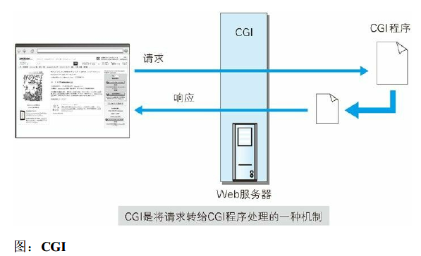
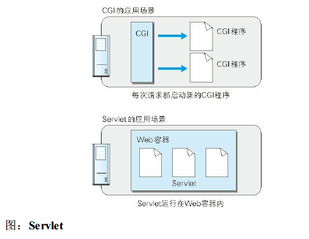

<!-- TOC START min:1 max:3 link:true asterisk:false update:true -->
- [构建Web内容的技术](#构建web内容的技术)
  - [HTML](#html)
  - [设计应用CSS](#设计应用css)
  - [动态HTML](#动态html)
  - [DOM](#dom)
  - [Web应用](#web应用)
    - [CGI](#cgi)
    - [Servlet](#servlet)
  - [数据发布的格式及语言](#数据发布的格式及语言)
    - [XML](#xml)
    - [JSON](#json)
<!-- TOC END -->
<!--more-->

# 构建Web内容的技术

## HTML
- 为了发送Web 上的超文本（Hypertext）而开发的标记语言。超文本是一种文档系统，可将文档中任意位置的信息与其他信息（文本或图片等）建立关联，即超链接文本。标记语言是指通过在文档的某部分穿插特别的字符串标签，用来修饰文档的语言。我们把出现在HTML 文档内的这种特殊字符串叫做HTML 标签（Tag）

## 设计应用CSS
- CSS（Cascading Style Sheets，层叠样式表）可以指定如何展现HTML内的各种元素，属于样式表标准之一
- CSS的理念就是让文档的结构和设计分离，达到解耦的目的

## 动态HTML
- 通过调用客户端脚本语言JavaScript，实现对HTML 的Web 页面的动态改造

## DOM
- 用以操作HTML 文档和XML 文档的API（Application Programming Interface，应用编程接口）

## Web应用
- 通过Web 功能提供的应用程序

### CGI
- Web 服务器在接收到客户端发送过来的请求后转发给程序的一组机制
  

### Servlet
- 一种能在服务器上创建动态内容的程序
- CGI，由于每次接到请求，程序都要跟着启动一次;而Servlet 运行在与Web 服务器相同的进程中，因此受到的负载较小
  

## 数据发布的格式及语言

### XML
- 按应用目标进行扩展的通用标记语言
- XML和HTML一样，使用标签构成树形结构，并且可自定义扩展标签

### JSON
- 以JavaScript（ECMAScript）的对象表示法为基础的轻量级数据标记语言
