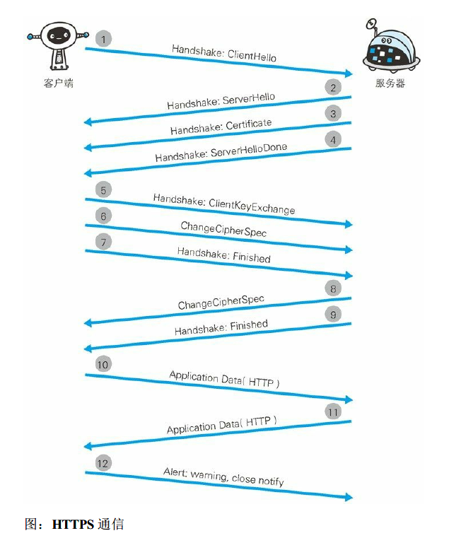

<!-- TOC START min:1 max:3 link:true asterisk:false update:true -->
- [确保Web 安全的HTTPS](#确保web-安全的https)
  - [HTTP缺点](#http缺点)
    - [使用明文通信](#使用明文通信)
    - [不验证通信方的身份就可能遭遇伪装](#不验证通信方的身份就可能遭遇伪装)
    - [无法证明报文完整性](#无法证明报文完整性)
  - [HTTPS](#https)
    - [HTTPS 是身披SSL 外壳的HTTP](#https-是身披ssl-外壳的http)
    - [HTTPS采用混合加密机制](#https采用混合加密机制)
    - [证书](#证书)
    - [SSL通信慢](#ssl通信慢)
<!-- TOC END -->
<!--more-->

# 确保Web 安全的HTTPS

## HTTP缺点
- 使用明文通信
- 不验证通信方身份
- 无法证明报文完整性

### 使用明文通信
- HTTP 本身不具备加密的功能，在互联网上传输容易找到窃听
- 加密处理防止窃听
  1. 通信的加密
    - 通过和SSL（Secure Socket Layer，安全套接层）或TLS（Transport Layer Security，安全层传输协议）的组合使用，加密HTTP 的通信内容
    - SSL 建立安全通信线路之后，就可以在这条线路上进行HTTP通信
  2. 内容加密
    - 对传输的内容进行加密

### 不验证通信方的身份就可能遭遇伪装
- HTTP任何人都可以访问
  - 无法确定请求发送至目标的Web 服务器是否是按真实意图返回响应的那台服务器
  - 无法确定客户端就是真实需要返回响应的客户端
  - 无法确认通信的对方的访问权限
  - 无法判定请求来之哪里
  - 容易遭到DoS、DDos攻击
- 通过查看对方证书来确认

### 无法证明报文完整性
- 无法确认报文是否被篡改
- 请求或响应在传输途中，遭攻击者拦截并篡改内容的攻击称为中间人攻击

## HTTPS
- 使用SSL或TSL进行加密认证通信

### HTTPS 是身披SSL 外壳的HTTP
- 使用SSL 时，则演变成先和SSL 通信，再由SSL 和TCP 通信

### HTTPS采用混合加密机制
- 在交换密钥环节使用公开密钥加密方式，之后的建立通信交换报文阶段则使用共享密钥加密方式

### 证书
- 由可信第三方机构颁发的可信任证明
- HTTPS通信
  
  

### SSL通信慢
- 加密与解密需要占用CPU和其他硬件资源
- SSL通信部分会消耗网络资源，增加延迟
