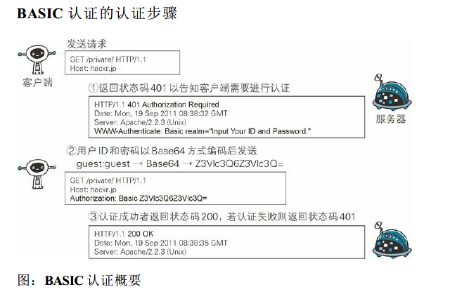
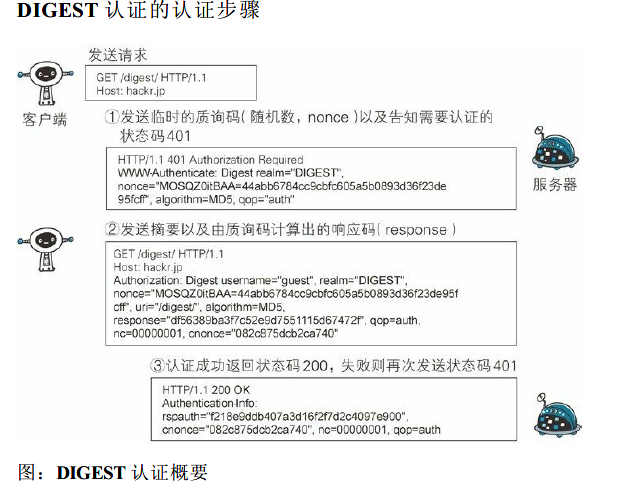
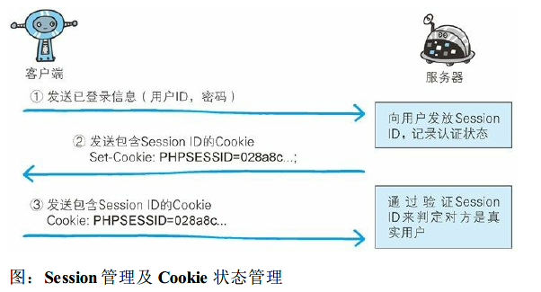

<!-- TOC START min:1 max:3 link:true asterisk:false update:true -->
- [确认访问用户身份的认证](#确认访问用户身份的认证)
  - [http认证方式](#http认证方式)
<!-- TOC END -->
<!--more-->

# 确认访问用户身份的认证
- 计算机不能判断使用者的具体身份，需要认证使用

## http认证方式
1. BASIC认证（基本认证）
- 认证过程
  
- 非加密处理

2. DIGEST 认证（摘要认证）
- 认证过程
  
- 质询响应方式是指，一开始一方会先发送认证要求给另一方，接着使用从另一方那接收到的质询码计算生成响应码。最后将响应码返回给对方进行认证的方式

3. SSL 客户端认证
- 借由HTTPS 的客户端证书完成认证的方式
- 认证过程
  1. 接收到需要认证资源的请求，服务器会发送Certificate Request 报文，要求客户端提供客户端证书
  2. 用户选择将发送的客户端证书后，客户端会把客户端证书信息以Client Certificate 报文方式发送给服务器
  3. 服务器验证客户端证书验证通过后方可领取证书内客户端的公开密钥，然后开始HTTPS 加密通信
- 认证采用双因素认证
  - 采用证书认证和表单认证相结合
  - 第一个认证因素的SSL 客户端证书用来认证客户端计算机，另一个认证因素的密码则用来确定这是用户本人的行为

4. FormBase 认证（基于表单认证）
- 认证过程
  
  1. 客户端把用户ID 和密码等登录信息放入报文的实体部分，通常是以POST 方法把请求发送给服务器
  2. 服务器会发放用以识别用户的Session ID。通过验证从客户端发送过来的登录信息进行身份认证，然后把用户的认证状态与Session ID 绑定后记录在服务器端
  3. 客户端接收到从服务器端发来的Session ID 后，会将其作为Cookie 保存在本地。下次向服务器发送请求时，浏览器会自动发送Cookie，所以Session ID 也随之发送到服务器
