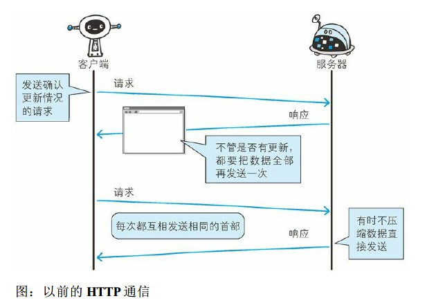
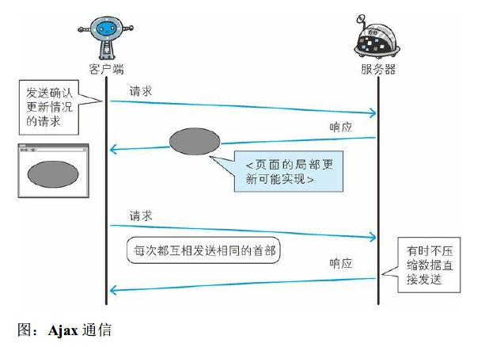
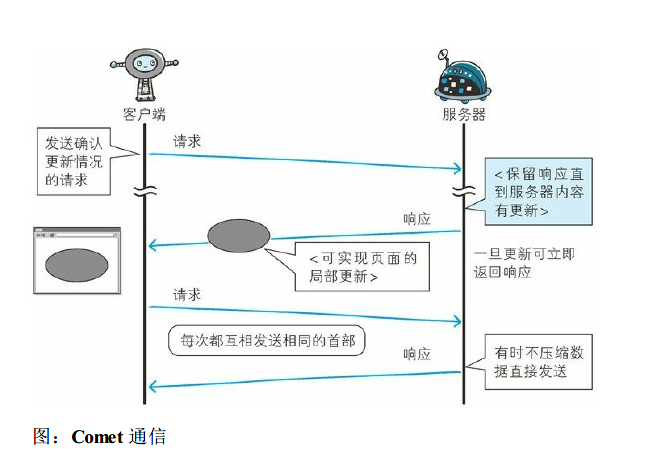
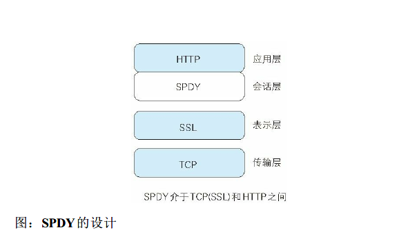
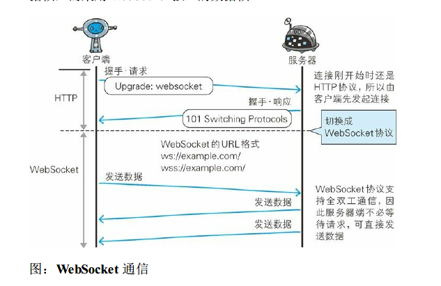

## 基于HTTP 的功能追加协议

### http瓶颈
- 原因
  1. 一条连接上只可发送一个请求
  2. 请求只能从客户端开始。客户端不可以接收除响应以外的指令。
  3. 请求/ 响应首部未经压缩就发送。首部信息越多延迟越大。
  4. 发送冗长的首部。每次互相发送相同的首部造成的浪费较多。
  5. 可任意选择数据压缩格式。非强制压缩发送。
  

### 解决方法

#### Ajax
- 局部Web 页面替换加载的异步通信手段
  

#### Comet
- 通过延迟应答，模拟实现服务器端向客户端推送（Server Push）的功能
- Comet 会先将响应置于挂起状态，当服务器端有内容更新时，再返回该响应
  

#### SPDY
- 以会话层的形式加入，控制对数据的流动
  

- 设计
  1. 多路复用流：通过单一的TCP 连接，可以无限制处理多个HTTP 请求
  2. 设置优先级
  3. 压缩HTTP首部
  4. 推送与服务器提示功能：支持服务器主动向客户端推送数据的功能；服务器可以主动提示客户端请求所需的资源

### 全双工通信的 WebSocket
- Web 浏览器与Web 服务器之间全双工通信标准
  1. 推送功能
  2. 减少通信量：一直保持连接状态
- 使用http首部中的upgrade首部字段实现连接
  1. 握手请求
  2. 握手响应
- 通信过程
  
